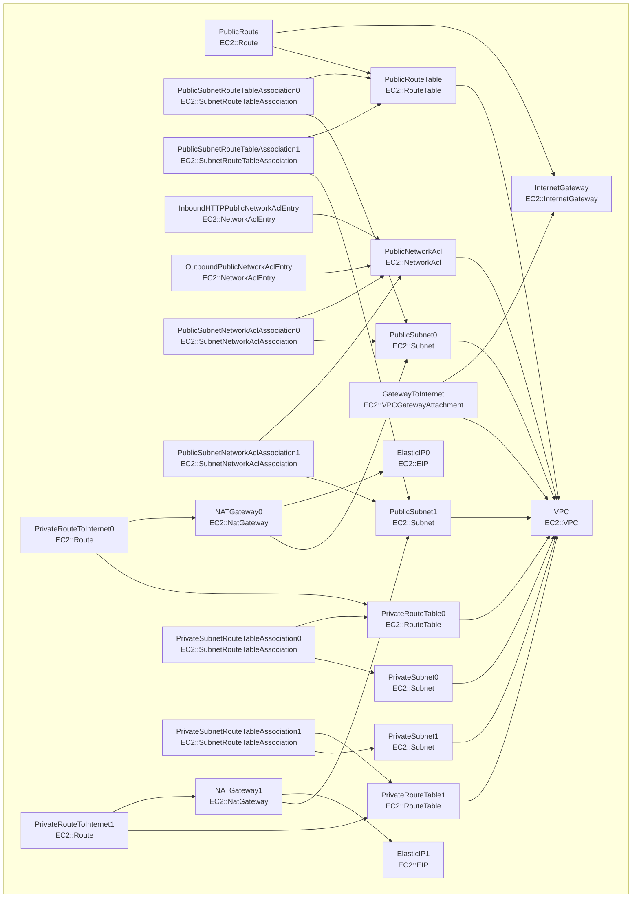

```mermaid
flowchart TB;
	subgraph &nbsp;
	rootPublicSubnet0[PublicSubnet0<br/>EC2::Subnet]-->rootVPC[VPC<br/>EC2::VPC]
	rootPublicSubnet1[PublicSubnet1<br/>EC2::Subnet]-->rootVPC[VPC<br/>EC2::VPC]
	rootPrivateSubnet0[PrivateSubnet0<br/>EC2::Subnet]-->rootVPC[VPC<br/>EC2::VPC]
	rootPrivateSubnet1[PrivateSubnet1<br/>EC2::Subnet]-->rootVPC[VPC<br/>EC2::VPC]
	rootGatewayToInternet[GatewayToInternet<br/>EC2::VPCGatewayAttachment]-->rootVPC[VPC<br/>EC2::VPC]
	rootGatewayToInternet[GatewayToInternet<br/>EC2::VPCGatewayAttachment]-->rootInternetGateway[InternetGateway<br/>EC2::InternetGateway]
	rootPublicRouteTable[PublicRouteTable<br/>EC2::RouteTable]-->rootVPC[VPC<br/>EC2::VPC]
	rootPublicRoute[PublicRoute<br/>EC2::Route]-->rootPublicRouteTable[PublicRouteTable<br/>EC2::RouteTable]
	rootPublicRoute[PublicRoute<br/>EC2::Route]-->rootInternetGateway[InternetGateway<br/>EC2::InternetGateway]
	rootPublicSubnetRouteTableAssociation0[PublicSubnetRouteTableAssociation0<br/>EC2::SubnetRouteTableAssociation]-->rootPublicSubnet0[PublicSubnet0<br/>EC2::Subnet]
	rootPublicSubnetRouteTableAssociation0[PublicSubnetRouteTableAssociation0<br/>EC2::SubnetRouteTableAssociation]-->rootPublicRouteTable[PublicRouteTable<br/>EC2::RouteTable]
	rootPublicSubnetRouteTableAssociation1[PublicSubnetRouteTableAssociation1<br/>EC2::SubnetRouteTableAssociation]-->rootPublicSubnet1[PublicSubnet1<br/>EC2::Subnet]
	rootPublicSubnetRouteTableAssociation1[PublicSubnetRouteTableAssociation1<br/>EC2::SubnetRouteTableAssociation]-->rootPublicRouteTable[PublicRouteTable<br/>EC2::RouteTable]
	rootPublicNetworkAcl[PublicNetworkAcl<br/>EC2::NetworkAcl]-->rootVPC[VPC<br/>EC2::VPC]
	rootInboundHTTPPublicNetworkAclEntry[InboundHTTPPublicNetworkAclEntry<br/>EC2::NetworkAclEntry]-->rootPublicNetworkAcl[PublicNetworkAcl<br/>EC2::NetworkAcl]
	rootOutboundPublicNetworkAclEntry[OutboundPublicNetworkAclEntry<br/>EC2::NetworkAclEntry]-->rootPublicNetworkAcl[PublicNetworkAcl<br/>EC2::NetworkAcl]
	rootPublicSubnetNetworkAclAssociation0[PublicSubnetNetworkAclAssociation0<br/>EC2::SubnetNetworkAclAssociation]-->rootPublicSubnet0[PublicSubnet0<br/>EC2::Subnet]
	rootPublicSubnetNetworkAclAssociation0[PublicSubnetNetworkAclAssociation0<br/>EC2::SubnetNetworkAclAssociation]-->rootPublicNetworkAcl[PublicNetworkAcl<br/>EC2::NetworkAcl]
	rootPublicSubnetNetworkAclAssociation1[PublicSubnetNetworkAclAssociation1<br/>EC2::SubnetNetworkAclAssociation]-->rootPublicSubnet1[PublicSubnet1<br/>EC2::Subnet]
	rootPublicSubnetNetworkAclAssociation1[PublicSubnetNetworkAclAssociation1<br/>EC2::SubnetNetworkAclAssociation]-->rootPublicNetworkAcl[PublicNetworkAcl<br/>EC2::NetworkAcl]
	rootNATGateway0[NATGateway0<br/>EC2::NatGateway]-->rootPublicSubnet0[PublicSubnet0<br/>EC2::Subnet]
	rootNATGateway0[NATGateway0<br/>EC2::NatGateway]-->rootElasticIP0[ElasticIP0<br/>EC2::EIP]
	rootNATGateway1[NATGateway1<br/>EC2::NatGateway]-->rootPublicSubnet1[PublicSubnet1<br/>EC2::Subnet]
	rootNATGateway1[NATGateway1<br/>EC2::NatGateway]-->rootElasticIP1[ElasticIP1<br/>EC2::EIP]
	rootPrivateRouteTable0[PrivateRouteTable0<br/>EC2::RouteTable]-->rootVPC[VPC<br/>EC2::VPC]
	rootPrivateRouteTable1[PrivateRouteTable1<br/>EC2::RouteTable]-->rootVPC[VPC<br/>EC2::VPC]
	rootPrivateRouteToInternet0[PrivateRouteToInternet0<br/>EC2::Route]-->rootPrivateRouteTable0[PrivateRouteTable0<br/>EC2::RouteTable]
	rootPrivateRouteToInternet0[PrivateRouteToInternet0<br/>EC2::Route]-->rootNATGateway0[NATGateway0<br/>EC2::NatGateway]
	rootPrivateRouteToInternet1[PrivateRouteToInternet1<br/>EC2::Route]-->rootPrivateRouteTable1[PrivateRouteTable1<br/>EC2::RouteTable]
	rootPrivateRouteToInternet1[PrivateRouteToInternet1<br/>EC2::Route]-->rootNATGateway1[NATGateway1<br/>EC2::NatGateway]
	rootPrivateSubnetRouteTableAssociation0[PrivateSubnetRouteTableAssociation0<br/>EC2::SubnetRouteTableAssociation]-->rootPrivateSubnet0[PrivateSubnet0<br/>EC2::Subnet]
	rootPrivateSubnetRouteTableAssociation0[PrivateSubnetRouteTableAssociation0<br/>EC2::SubnetRouteTableAssociation]-->rootPrivateRouteTable0[PrivateRouteTable0<br/>EC2::RouteTable]
	rootPrivateSubnetRouteTableAssociation1[PrivateSubnetRouteTableAssociation1<br/>EC2::SubnetRouteTableAssociation]-->rootPrivateSubnet1[PrivateSubnet1<br/>EC2::Subnet]
	rootPrivateSubnetRouteTableAssociation1[PrivateSubnetRouteTableAssociation1<br/>EC2::SubnetRouteTableAssociation]-->rootPrivateRouteTable1[PrivateRouteTable1<br/>EC2::RouteTable]
end

```
